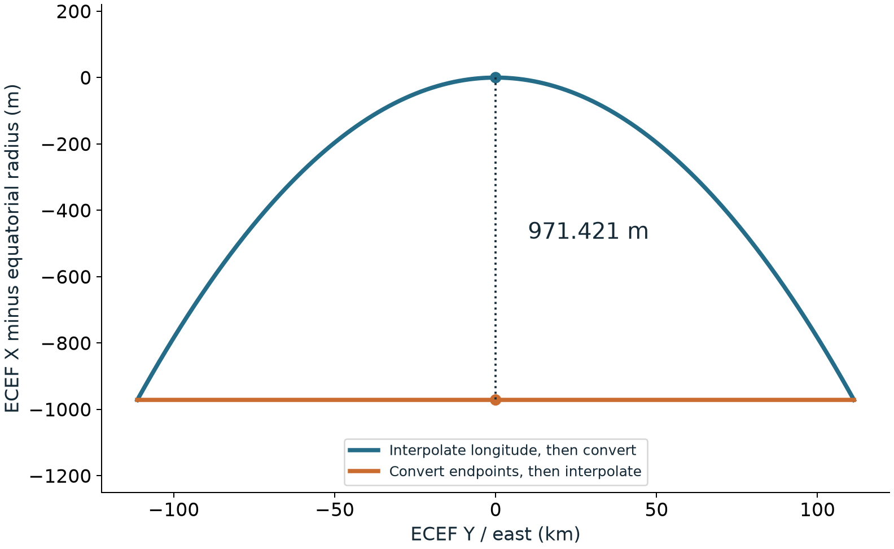
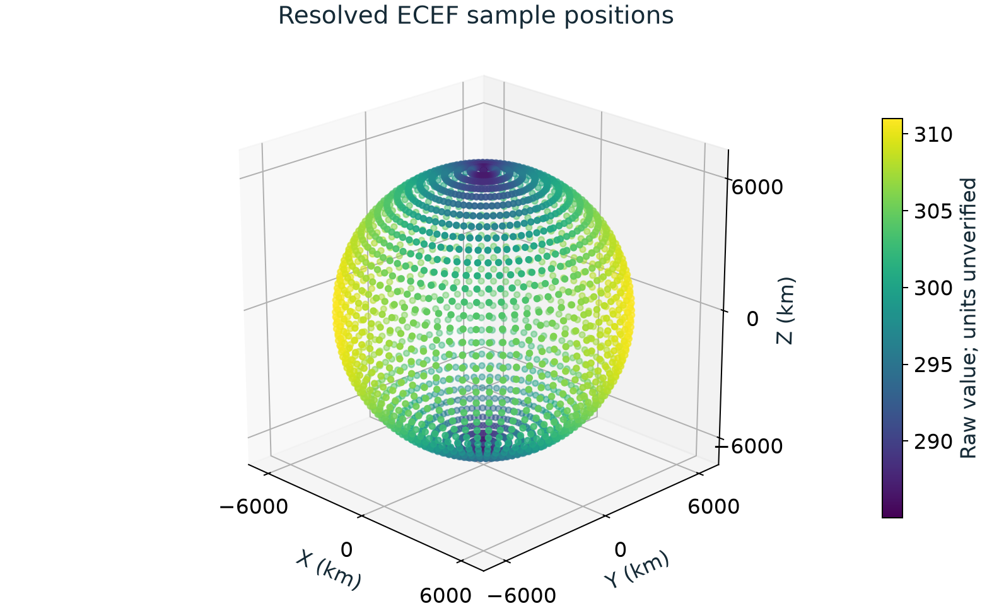
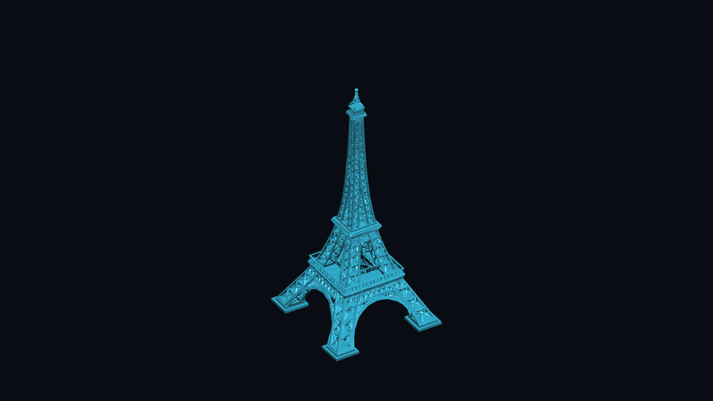
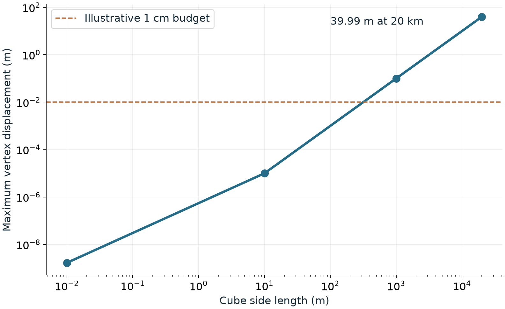

# usdGeospatial — complete experimental build

<!-- narrative:v2 -->

## Geospatial scenes with shared placement

<!-- slide -->
- Place railway data, a calibrated site and a removable scalar overlay while retaining their source data.
- Headless queries, native Hydra/Storm and Omniverse Fabric consume the same evaluated placement.
- Execute every workflow and test alternative rules; use the failures and discrepancies to improve the design.

This build starts with the functional requirements, derives proposed runtime
behavior, implements explicitly labeled choices where the design is open, and
executes the complete declared demonstration scope. Delivery is part of the run:
this README supplies the review summary and slide deck. Design approval and survey
accuracy remain separate from completing the implementation and demonstrations.

Read the [runtime behavior draft](proposal/runtime-behavior.md),
[executable candidate rules](proposal/runtime-experiments.md),
[open decisions](proposal/runtime-open-decisions.md) and [workflow evidence](docs/WORKFLOWS.md).

## Railway source and scene identity

<!-- slide -->
<!-- evidence:railway -->
- All source features and vertices resolve; polygon rings and identities remain traceable.
- Full curve comparison reports the provider USD's interior discrepancy, beyond matching anchors.
<!-- /evidence:railway -->
- Three map tiles share the output frame. Height interpretation is explicit; survey metadata remains unknown.

The original GeoJSON supplies an independent check on the converted USD. Fresh
fixture preparation preserves every original coordinate, object ID and polygon
group, including holes. It explicitly selects a projected modelling frame under
a WGS84 ellipsoidal-height hypothesis. The provider USD is resolved separately,
and every retained curve vertex is compared against the original.

Matching first-coordinate anchors did not expose the offset-basis choice. The
complete run does: geographic-coordinate linearization differs by up to 16.7 cm,
while a Cartesian east/north/up basis agrees within about 42 micrometres, consistent
with stored float-point precision. This supports a rule choice rather than a claim
that the provider data is wrong. The tile images use resolved corner placement;
the image display is an affine visualization of each tile, not certified pixel
georeferencing. Source vertical datum, epoch and certified map controls remain
open interpretation questions. See [dataset provenance](DATASETS.md).

## Native interpolation preserves the authored path

<!-- slide -->
- Both experimental position carriers interpolate recorded native coordinates before conversion.
<!-- evidence:interpolation -->
- The scene midpoint avoids the displacement caused by interpolating converted endpoints.
<!-- /evidence:interpolation -->
- Edits invalidate evaluated results; explicit export records its CRS and sampled times.

The counterexample now runs through authored scene positions. It also tests cache
invalidation, explicit sampled export and re-reading without applying the original
placement twice. Seven composition forms, native instances and masked point
instances exercise the same shared result. Baked interpolation between exported
samples is explicitly distinguished from native-CRS evaluation.

## Scalar data and a removable visualization

<!-- slide -->
<!-- evidence:field -->
- Every raw scalar sample participates in the resolved scene; the complete geometry overlay is removable.
<!-- /evidence:field -->
- Omniverse Fabric and native Hydra receive the same placements while source values remain unchanged.
- Physical units, forecast origin, timestamp and source CRS metadata remain unverified.

Non-geometric records retain all raw values. A separate visualization layer adds
one marker per sample, then removes every marker through the consumer update path.
The fixture explicitly prepares ECEF positions so poles require no guessed east
direction. The filename is not evidence of a verified weather product.

## Site placement remains separate from asset conformance

<!-- slide -->
- The supplied local-grid calibration places the complete tower in Lambert-93 with IGN69 height.
- Project relocation and a constructed incline change placement while the source asset stays unchanged.
- The image is a real Storm render of the new native scene index; no retired geospatial plugin is loaded.

The calibrated grid changes the meaning of an offset: site-grid east/north axes
rotate and scale relative to Lambert-93. Asset conformance is recorded separately
from those placement choices. The run checks the complete geometry, approximately
300 m asset height, calibration, ordinary edits, relocation and a five-degree
constructed incline. The raw partner attachment stays outside this repository.

## Two runtime targets

<!-- slide -->
- Non-Hydra: read-only scene resolution, coordinate and relative-placement queries, bounds, edits and export.
- Hydra: a compiled scene index with geometry, topology and change notices, rendered directly by Storm.
- Omniverse Fabric is an additional real consumer; independent Karney arithmetic checks geodetic consistency.

| Layer | Executed behavior | Evidence boundary |
|---|---|---|
| Non-Hydra runtime | Composed positions, ordinary offsets, project placement, time, instances, bounds and queries | Explicit candidate contract |
| Native Hydra | Same evaluated matrices and geometry, change notices and direct Storm rendering | Shared resolver; not a second coordinate engine |
| Omniverse Kit/Fabric | Runtime geometry, double world placement and extents; readback after complete frame changes | Authored USD unchanged; this is a Fabric consumer test |
| Independent numerical engine | Karney ECEF and exact transverse Mercator compared with PROJ at both hemispheres | Static, same-datum support; unsupported operations fail |

Consumer agreement establishes that the evaluated scene survives its integrations.
Independent arithmetic provides a different check. Neither replaces practitioner
controls or approval of the candidate rules. Exact versions and residuals are in
the [run evidence](docs/FIXTURES.md).

## Design choices exercised by the complete run

<!-- slide -->
- Affine and pointwise placement are both implemented; extent sweeps reveal where one matrix loses fidelity.
- Applying an ancestor transform after an absolute position produces a tested 1,000 m violation.
- Missing grids or coordinate epochs fail observably; animation time never supplies a coordinate epoch.

The 20 km example shows about 40 m maximum vertex displacement from one affine
placement, while centimetre detail remains measurable at global magnitude.
An explicit distance budget rejects unsuitable affine placement. The pointwise
alternative executes; it does not silently certify unsampled continuous surfaces.
Whether R24 covers vertices, edges or every point on a surface is an actual design
question, supported here by measured alternatives.

Other executed choices include attribute/translate carriers, stage-convention or
author-conformed units, output-target precedence, geographic output, dependency
records and empty bindings. See the [candidate contract](proposal/runtime-experiments.md)
for their mechanisms and [open decisions](proposal/runtime-open-decisions.md) for
what review must settle. There is no deferred implementation milestone in this run.

## Review requests

<!-- slide -->
- Approve the drafted functional requirements and select among the executed runtime alternatives.
- Clarify the extent/bound domain, unit and offset basis, project placement and dependency/target rules.
- Supply certified vertical/epoch metadata and control points where accuracy claims are required.

The canonical proposed normative text is [proposal/runtime-behavior.md](proposal/runtime-behavior.md).
It traces all 29 requirements; the [traceability report](docs/RUNTIME.md) maps them
to implementation and evidence. Changes to requirements or reviewed prose force
re-derivation. A complete run requires every workflow, a fresh native build, all
consumer checks, no skipped tests and regenerated delivery artifacts. The
[build procedure](BUILD_LOOP.md) makes that gate repeatable for subsequent changes.

## Run evidence

<!-- evidence:run -->
The delivery phase fills this block only from the current complete run.
<!-- /evidence:run -->

[Editable slides](docs/checkpoint.pptx) · [Slide PDF](docs/checkpoint.pdf) ·
[Review summary](docs/PR_BODY.md) · [Bundled requirements](inputs/requirements.md)
