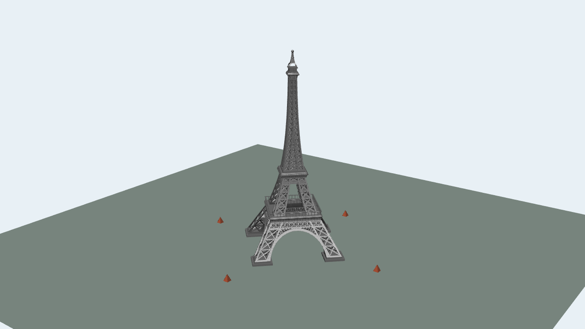
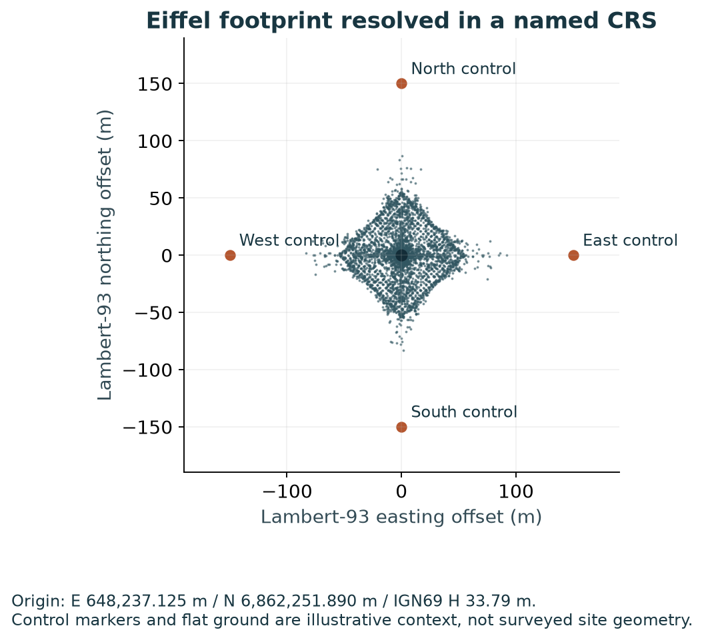
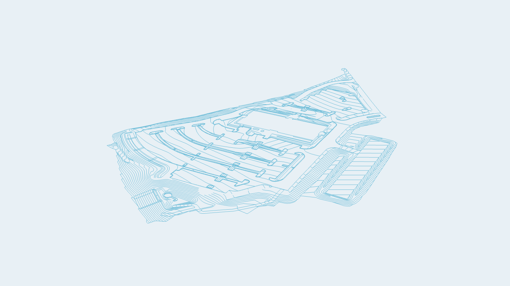
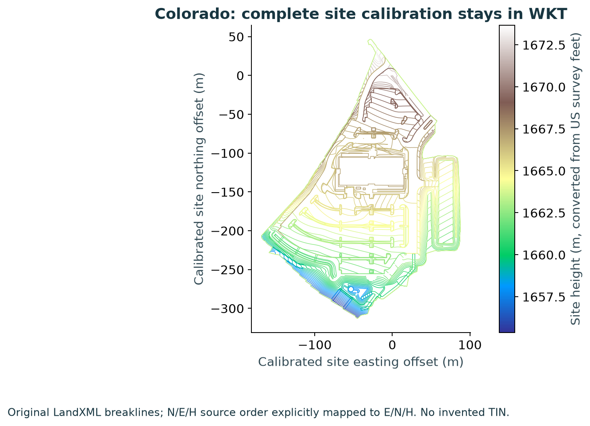
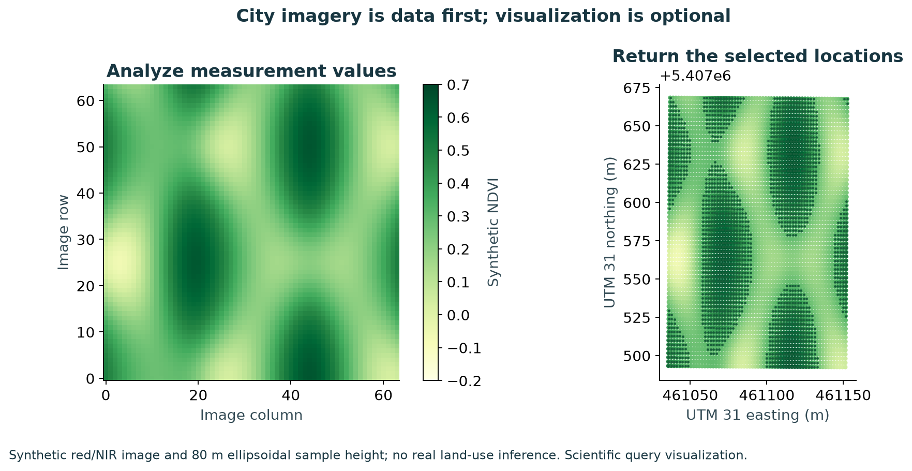
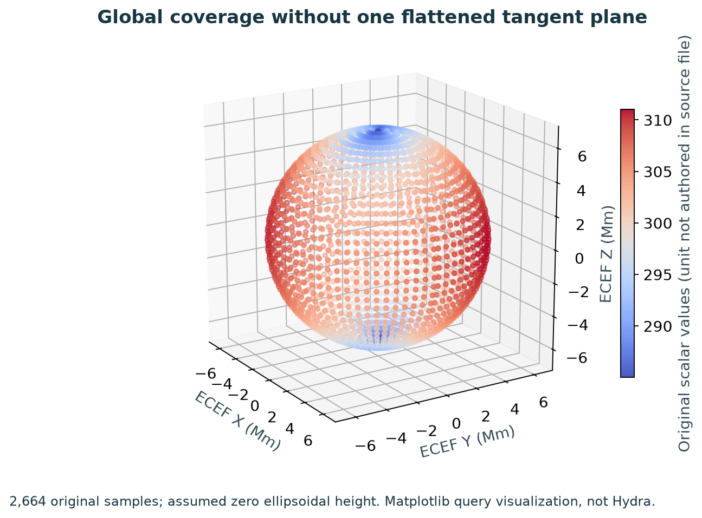
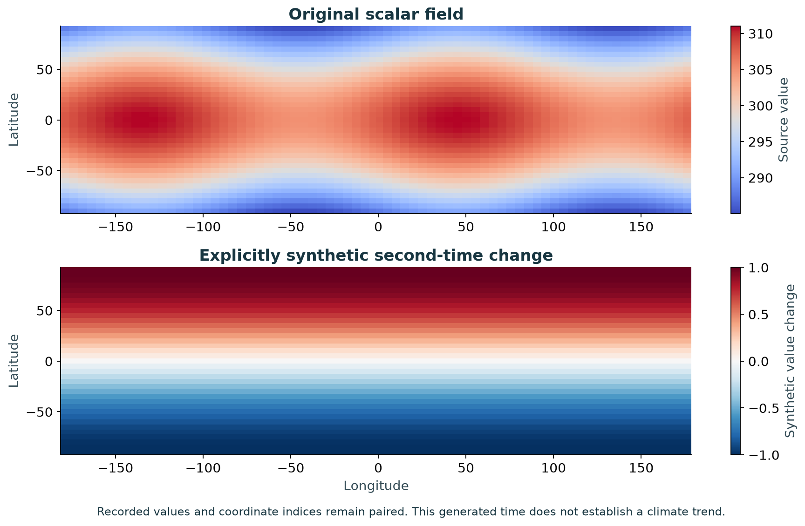
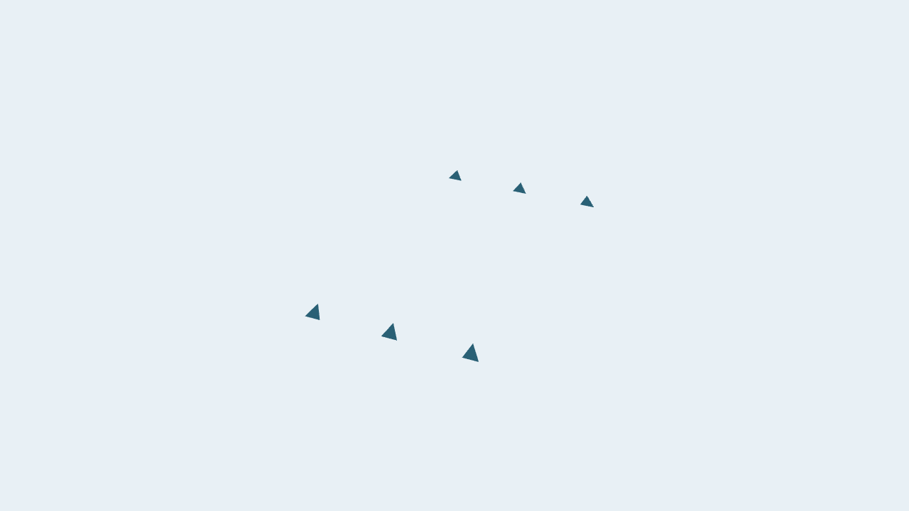

# Geospatial proposal readiness and experimental evidence

**The proposal is not yet independently implementable.** This loop audits all 31 functional requirements and identifies ten open categories in the data model and normative runtime behavior. Most intended outcomes are already required; their missing representation, conventions and guarantees cannot be supplied by prototype choices. Proposal readiness and requirements-build completion both remain **false**.

[Proposal quality review](QUALITY_REVIEW.md) · [Editable slides](delivery/geospatial-build.pptx) · [PDF](delivery/geospatial-build.pdf) · [Run receipt](delivery/run-report.json) · [Implementation audit](AUDIT.md) · [Build gate](BUILD_LOOP.md)

The audit and corrective experimental delivery are complete. This is not a claim that the proposal-conformance build passed. The explicitly authorized experiment executed 80 tests, 28 three-consumer jobs and 7 fresh-reader exports. It cannot close a shared semantic decision. Source `69e4cdbed03cec5a9c89b1e8938c028001e2dcf0` and every executed input are hash-bound to the receipt.

## Contracts still missing from the proposal

The agreed outcomes remain useful: complete WKT CRS definitions, separate model placement, ordinary USD transforms after resolution, preserved source data and both rendering and coordinate queries. The following contracts must be completed against those outcomes rather than copied from a convenient implementation.

| Gap | Shared contract to settle | Existing requirement numbers |
|---|---|---|
| G01 | Binding carrier and contradictory legacy text | 5, 6, 7, 9, 11, 19, 25 |
| G02 | Placement types, bases, defaults and frame meaning | 9, 10, 11, 12, 14, 15, 20 |
| G03 | Working context and adjusted measurement placement | 8, 9, 11, 16, 19 |
| G04 | Axis conventions and supported result domains | 12, 13, 14, 16, 17, 18 |
| G05 | OGC-grounded WKT string normal form | 1, 2, 3, 21, 27, 28, 29, 31 |
| G06 | Measurement property association and adapters | 5, 6, 7, 12, 18, 19, 21, 27, 30 |
| G07 | Complete-asset declaration and assembly obligations | 7, 19, 25, 26, 27 |
| G08 | Extent/error guarantee and comparable operations | 17, 18, 21, 22, 23, 24, 28, 29 |
| G09 | Structured export sampling and preservation coverage | 2, 18, 19, 20, 27, 30 |
| G10 | 2D/3D coordinate meaning and height-frame support | 1, 4, 12, 21, 22, 30 |

[The review](QUALITY_REVIEW.md) maps every requirement to executed evidence and its remaining gaps, with proposed closure for each. These are review categories, not ten new functional requirements or a proof that no further gap exists. The candidate remains an explicit experiment; freezing its choices before code never made them shared proposal authority.

## Why implementation did not stop

I substituted the frozen experimental candidate for shared-proposal authority and audited code against that candidate more thoroughly than the candidate against the actual proposal. Selecting only the requirements hid conflicting retained translate/reset/API sketches instead of reconciling the whole text.

I also failed to make known gaps block completion. The earlier audit recorded the R24 extent/error gap, but the README opened with a complete experimental run and the slides led with a render. Self-selected tests omitted bounds, relative frames and default-output behavior, and fixture-named export checks missed dropped properties. Permission to explore labeled alternatives did not authorize treating those choices as settled semantics. This was my process failure; it did not reflect missing cooperation from the group.

- Cite exact proposal authority for each required authored fact, default, scope, ordering, time rule, failure and acceptance criterion.
- When that authority is missing or conflicting, stop the dependent derivation and flag the affected requirement immediately.
- Continue independent work or authorized labeled experiments; keep their assumptions separate from proposal conformance.
- Review specification repairs from requirements and data ownership, freeze new semantics before code, and invalidate affected evidence.
- Keep missing tests classified as unfinished verification. Passing tests cannot approve model choices.

The default runner now stops before dependent execution while semantic gaps remain. An explicit experimental invocation records `proposal_ready=false` and `requirements_build_complete=false`; there is no successful-run override that changes those conclusions.

## Repairs and checks that did not require a new shared decision

A separate local proposal draft removes obsolete callable signatures, translate-based CRS placement, the helper that authored resetXformStack and rendering architecture prescriptions. It preserves the recorded separate-placement and post-transform direction and leaves the exact binding/field contract open. That proposal cleanup is committed locally, **not pushed or agreed**; its revision is recorded in the quality receipt.

Existing failure/source-preservation requirements justify rejecting a broken enclosing binding instead of treating it as absent, validating inherited coordinate roles, retaining arbitrary ordinary dataset property names/metadata/relationships, and avoiding duplicated output WKT in export metadata. The experiment also tests composed-default output precedence, affine leaf bounds including curve widths, relative model frames and standard USD instance export. Where a new experimental representation was necessary, it was specified and committed before affected code; it remains unapproved.

WKT **string** normalization now covers structural parentheses as well as square brackets while preserving quoted punctuation. OGC permits the former and prefers the latter; the installed projection engine rejects the parenthesis spelling directly. Parser capability therefore cannot define all OGC-valid text. The full lexical normalization profile remains G05, and lexical token identity is not semantic CRS equivalence. [OGC 18-010r11, clauses 6.3.4 and 6.4](https://docs.ogc.org/is/18-010r11/18-010r11.pdf).

## A newly exposed dependency: placed measurement data

Absolute sample coordinates and a model's local geometry are different kinds of data. The proposal does not yet fully define how model placement and ordinary project adjustments affect arrays of absolute measurement coordinates, including the working frame and pivot when a geographic context is involved.

The city/global fixtures used unadjusted datasets. Converting those arrays demonstrates coordinate queries and preserves values/indices/times, but does not demonstrate adjusted imagery under requirements 8 and 17. I stopped that dependent derivation and recorded it in G03/G06; no centroid, hidden origin, extra flag or new placement field was introduced to rescue it.

A related distinction is CRS definition validity versus the support needed for a requested result. A valid 2D definition does not supply physical height; geographic gravity-related height cannot silently become ellipsoidal Cartesian height. The three-component candidate does not establish universal 2D/compound-height model support. G10 requires result-specific information and failure semantics, not a schema restriction copied from vector3 code.

## Extent and error remain a proposal gate

Double anchors avoid absolute-coordinate float quantization, but an affine model frame approximates nonlinear per-point conversion. Requirement 24 calls for a stated placement error over a stated extent; the proposal has not yet supplied a complete contract for establishing that guarantee, its coverage or failure/subdivision behavior.

For a UTM model frame converted to ECEF, the experiment measures 289 points per square:

| Sampled domain half-extent | Samples | Maximum affine discrepancy |
|---|---:|---:|
| ±1 m | 289 | 1.59728973e-07 m |
| ±10 m | 289 | 1.56920427e-05 m |
| ±100 m | 289 | 0.00156852519 m |
| ±1,000 m | 289 | 0.156846084 m |
| ±10,000 m | 289 | 15.6846085 m |
| ±100,000 m | 289 | 1568.44951 m |

These are finite sampled discrepancies, not a bound on every point or surface in the extent. The ±100 km sample is about 1.57 km from the per-point result. Probe stability and small cross-runtime differences do not close the guarantee. Engine-attributed operation accuracy also excludes affine approximation, ordinary post transforms and survey truth; complete-chain reporting remains G08.

The added affine leaf-bounds controls use stock UsdGeom local extent, including curve widths, transformed by the same derived frame. They do not bound nonlinear per-point conversion or establish universal primitive, aggregate, angular or physics bounds.

## The same authored data reaches three consumers

The corrective experiment compares headless OpenUSD queries, an independent native Hydra resolver and an independent live OV resolver on the same authored data. It records 760,792 positional samples across 28 jobs, 51 affine leaf-bound comparisons and 76 relative-frame comparisons. Maximum native discrepancy is 0.000104 mm and maximum OV discrepancy is 0.000000 mm.

| Same first Colorado breakline vertex | Easting (m) | Northing (m) | Height (m) |
|---|---:|---:|---:|
| Headless USD | 490154.882832 | 4416473.740389 | 1655.208918 |
| Native Hydra resolver | 490154.882832 | 4416473.740389 | 1655.208918 |
| Live OV resolver | 490154.882832 | 4416473.740389 | 1655.208918 |

All three consumers use PROJ, and the supplied partner CSVs also use PROJ. This is independent authored-scene/runtime agreement, not independent geodetic-engine accuracy. Actual final Hydra matrices, instance transforms and extents are read back; live OV checks ingested geometry, widths, runtime matrices and coordinate results. No OV visual-render parity is claimed.

| Dataset | Jobs | First-job samples | Native max (mm) | OV max (mm) |
|---|---:|---:|---:|---:|
| Eiffel model + context | 4 | 163,440 | 0.000000 | 0.000000 |
| Colorado breaklines | 3 | 14,359 | 0.000104 | 0.000000 |
| Original railway | 3 | 15,822 | 0.000002 | 0.000000 |
| Synthetic city imagery | 2 | 4,096 | 0.000000 | 0.000000 |
| Global scalar grid | 3 | 2,664 | 0.000000 | 0.000000 |
| Composition + time | 3 | 6 | 0.000002 | 0.000000 |
| Native + point instances | 2 | 15 | 0.000000 | 0.000000 |
| Composed-default output | 1 | 6 | 0.000000 | 0.000000 |
| Partner controls | 7 | 5 / 59 | 0.000000 | 0.000000 |

Full arrays, source-property associations, operation reports, resource hashes and USD/PROJ versions accompany the receipt. Counts include repeated output selections, not distinct real-world observations.

## Eiffel: see the placement and its coordinate context

The Eiffel model is placed at Lambert-93 E 648,237.125 m, N 6,862,251.890 m and IGN69 height 33.79 m, with a 45° CRS orientation. The same authored model resolves into Lambert-93, two UTM zones and ECEF.

The first image is an actual native Hydra/Storm draw from the early candidate scene-index override, before instance propagation and flattening. The second is a headless query plot in named coordinate axes. Ground and cardinal controls are illustrative, not a surveyed Paris dataset. Both images are needed: appearance alone is insufficient evidence of correct placement.

The original model's erroneous `metersPerUnit=0.01` metadata remains untouched. Its known metre geometry and Y-up convention are handled by the writer's assembly corrective. Reader code does not infer correct units from the shape of a familiar building. Model credit: SDC PERFORMANCE™️ (https://sketchfab.com/Lambo_SC04); CC-BY-4.0 (http://creativecommons.org/licenses/by/4.0/); [original source](https://sketchfab.com/3d-models/free-la-tour-eiffel-8553f94d06e24cb4b0fde1080f281674).

## Colorado and France: complete CRS definitions do real work

The partner data exercise geographic, projected, compound height and derived site-calibration definitions. Colorado keeps US survey feet and its full horizontal/vertical site calibration in WKT; France keeps Lambert-93/CC49 and IGN69 height meaning.

The LandXML contains 14,359 vertices in 710 coordinate parts. It is displayed as original breaklines, without inventing a terrain TIN. Source N/E/H order is explicitly mapped to E/N/H, with metre local geometry and a double coordinate anchor. Five Colorado and 59 France controls are checked in their supplied reference systems.

| Supplied control comparison | Points | Maximum CSV discrepancy (mm) |
|---|---:|---:|
| Colorado_01 → Colorado_02 | 5 | 0.0212 |
| Colorado_02 → Colorado_03 | 5 | 0.0342 |
| France_01 → France_02 | 59 | 0.0608 |
| France_01 → France_03 | 59 | 0.0822 |
| France_01 → France_04 | 59 | 0.0496 |

The supplied CSVs were computed with PROJ 9.8.1. These comparisons test intake, association and rounding, not independent-engine or survey accuracy. Required height grids are [identified and hash-verified](delivery/resources.json); missing resources reject the whole result. Ordinary datum/height operations are exercised without adding USD properties for engine-selected grids.

## City analysis returns data, not just a picture

A 64 × 64 synthetic red/NIR image yields 1,850 samples above NDVI 0.3. The result returns locations in the requested CRS while preserving source indices, values and observation times.

[Selected GeoJSON features](delivery/city-selected-features.geojson) and [the paired analysis product](delivery/city-analysis-product.json) are usable without a renderer. The heatmap is a scientific headless-query visualization. Its bands, observation time and 80 m ellipsoidal sample height are explicit synthetic inputs; it makes no real land-use claim.

The [original railway query](delivery/railway-query.png) carries all 15,822 vertices and 2,386 coordinate parts from the supplied GeoJSON into UTM, geographic and ECEF results. Its third coordinate is conditionally interpreted as WGS84 ellipsoidal height because the original EPSG:4326 label alone does not specify a height reference. Original topology and source coordinates remain available.

## Global measurements keep coordinates, values and time together

The original 37 × 72 scalar grid resolves all 2,664 locations globally in ECEF and geographic coordinates. Values remain associated with their coordinates and grid indices across two recorded times.

The initial scalar field comes from the supplied NetCDF; its units and heights are not authored in that file. Positions use explicitly assumed zero ellipsoidal height. The second time is an explicitly synthetic perturbation, not an observed trend or forecast. [The analytic product](delivery/climate-analysis-product.json) preserves both value arrays with the same coordinate indices. These are scientific query plots, not Hydra renders and not one global tangent plane.

This exercises useful larger-scale data workflows alongside construction-site placement. Initial scope does not impose a site-sized domain on measurements or make later coordinate-epoch support impossible.

## Composition, edits and sampled export

Three native USD instances and three point instances share ordinary geometry while resolving distinct placements. References, stronger opinions, variants, source interpolation, stage units/up-axis and explicit/default outputs have distinguishing controls. Native source notices and live OV source/request edits invalidate results; broken definitions remove stale successful results and recovery is exercised.

7 derived assets are reopened and resolved at explicit times 0, 5 and 10. Export preserves composed ordinary USD content, including standard instance data and arbitrary ordinary measurement properties/metadata/relationships; output placement and absolute coordinate arrays are sampled. The output CRS is recorded only in a typed definition and its bindings. No private resolved flag prevents double application. This is an experimental export representation, not an approved standard encoding.

| Exported dataset | Output | Geometry roundtrip max | Measurement roundtrip max |
|---|---|---:|---:|
| composition | utm31 | 0.00 µm | 0.00 µm |
| tower | utm31 | 0.01 µm | 0.00 µm |
| terrain | Colorado_02 | 0.02 µm | 0.00 µm |
| city | utm31 | 0.00 µm | 0.00 µm |
| climate | ecef | 0.00 µm | 0.00 µm |
| instances | utm31 | 0.00 µm | 0.00 µm |
| climate | geographic | 0.00 µm | 0.00 µm |

Fresh-reader instance-position checks are included. Equivalence to the original source-CRS trajectory between sample times is explicitly not promised. Generic external dataset adapter coverage and a shared structured sampling record remain G06/G09; they are not proved by these on-prim fixtures.

## What must be settled before proposal conformance

The next shared revision must reconcile the binding and placement model, define adjusted measurement/frame semantics and result support, prescribe WKT string normalization, and complete dependency, export and extent/operation guarantees. Every repair must cite existing requirements and USD/OGC semantics before affected implementation is rederived. Candidate choices and test success cannot settle those decisions.

Coordinate epochs remain deferred in representation, interpretation and computation. CRS frame epochs remain in WKT, and supported non-epoch datum/height operations use engine-managed resources. Large city/global coordinate datasets remain useful initial scope; the construction examples do not impose a site-sized domain. No deferred capability is made impossible by a hidden surrogate field.

The full requirement/gap map and why-stop investigation are in QUALITY_REVIEW.md. The run delivers auditable evidence and current collateral while honestly failing the proposal-readiness gate.

## Reproduce and inspect

The default runner stops on open semantic gaps. An explicitly authorized experiment adds `--experiment-with-open-specifications` to `run.py`; its receipt still records proposal readiness and requirements-build completion as false. Use a fresh output directory with the recorded stock USD imaging SDK, Python dependencies, OV runtime, PROJ database and TIFF-enabled native library. Required resources are hash-verified and network fallbacks disabled.

`collateral/build_readme.py --run-directory <run>` generates this canonical narrative from the source-bound receipt and quality audit. `collateral/derive.py` derives the PR body and slide content; the editable deck and PDF are rendered and inspected before delivery. No private email, original attachment ZIP or upstream issue/PR backlink accompanies delivery.

[Build contract](BUILD_LOOP.md), [datasets/credits/assumptions](data/README.md), [original hashes](data/manifest.json), [pinned requirements](proposal/requirements.md), [experimental data model](proposal/data-model.md), [experimental runtime behavior](proposal/runtime-behavior.md) and [immutable receipt](delivery/run-report.json) accompany the evidence.
