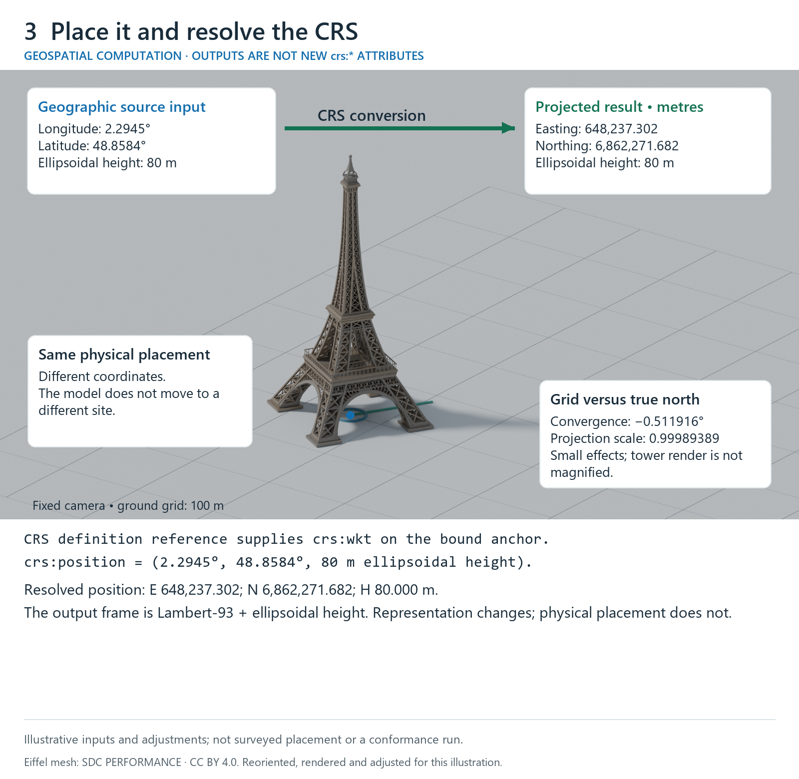
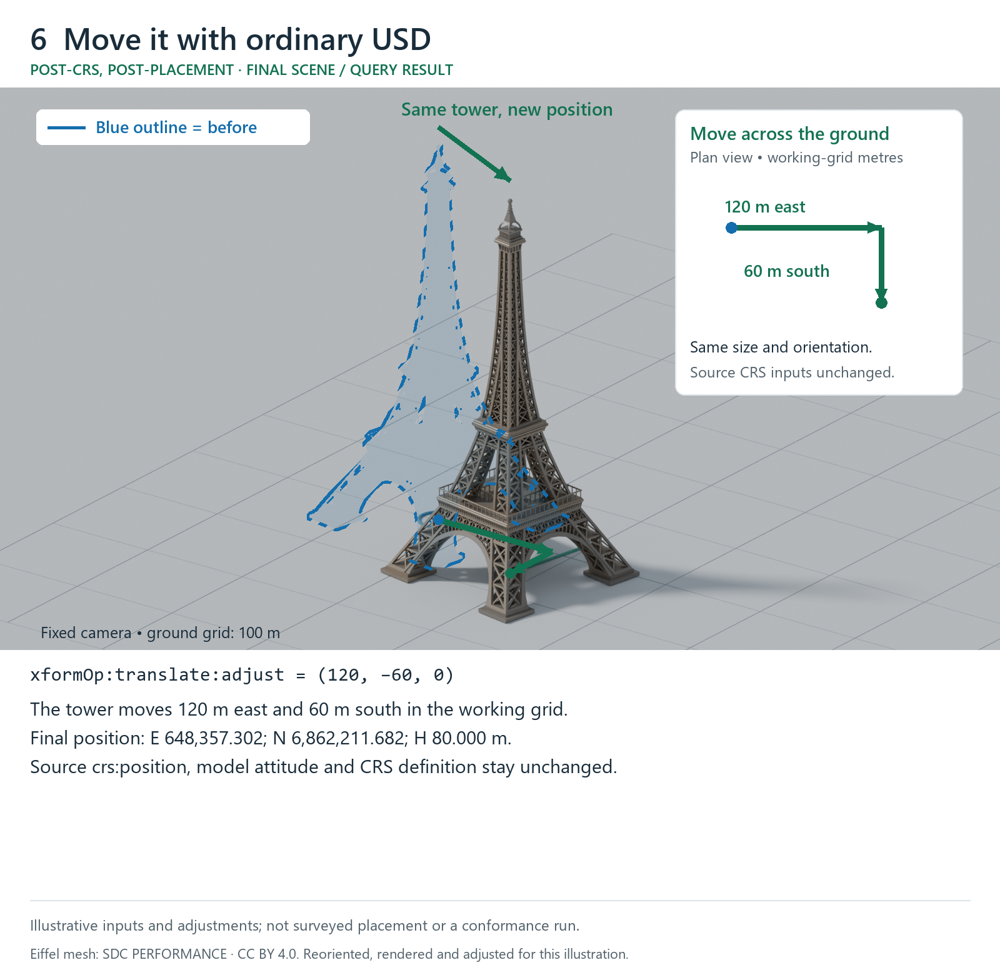
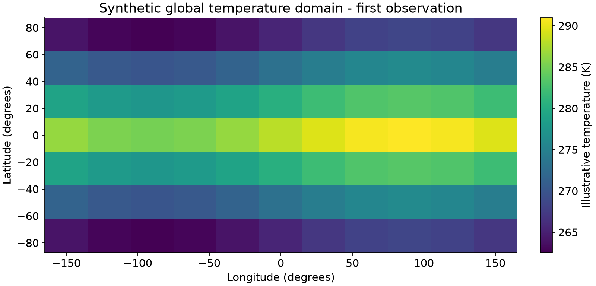

# Geospatial proposal: mergeable requirements and a tested follow-up

USD describes a 3D model's shape and size. Geospatial information says where it belongs on Earth, so models, surveys and measurements can work together.

The local split gives reviewers a focused requirements baseline and a separate full model/runtime candidate. Clearer array, invalid-input and bake rules now have fresh tests.

[Slides](delivery/geospatial-build.pptx) · [PDF](delivery/geospatial-build.pdf) · [Proposal snapshot](proposal/proposal-source.txt) · [Build loop](BUILD_LOOP.md)

## Assessment of the proposal

| Review dimension | Current assessment |
|---|---|
| Proposal definitions | A focused requirements baseline is separate from the full candidate used for execution. Supported meaning and pending conventions are distinguished. |
| Newly confirmed model gap | No additional undefined model rule was confirmed in reviewed paths. This is a scoped assessment, not an exhaustive completeness proof. |
| Implementation evidence | The selected cases work. 6 prior defects pass fresh counterexamples; 1 remains unresolved. |
| Deferred capabilities | Coordinate epochs and scene-authored transformation resources remain on the roadmap. Initial choices must preserve a path to adding them. |

All prior recorded numeric results match. Six audited defects are corrected; normal sampling remains unresolved. Orientation storage and detailed conventions still need review.

## Changes since the previous run

The requirements baseline can be reviewed without approving exact schema fields or runtime conventions. The full follow-up retains the complete candidate for derivation and testing.

| Compared aspect | Finding |
|---|---|
| Review scope | All 31 requirement IDs remain. Exact fields, evaluation rules, illustrations and detailed examples move to the stacked follow-up. |
| Contract clarity | Dimension-name ordering, invalid-placement failures and required precision-preserving ordinary USD bakes are explicit. |
| Numerical results | All 105 recorded case comparisons exactly match the prior run. |
| Implementation audit | Six counterexamples pass after repair; normal sampling still lacks justified approximation evidence. |
| Alignment | Input-only physical meaning and anchor/descendant distinction have supportive feedback. Stored orientation and detailed carrier/chart conventions remain candidate. |

[Full comparison](delivery/run-comparison.json)

## Source inputs and computed placement

### A geographic location for a 3D model

**Question.** Can a reader distinguish the model's shape from its location on Earth?

The scene records local geometry separately from its geographic origin and physical orientation. A coordinate reference system (CRS) defines how to interpret the origin's axes, units and height.

**Expected behavior.** A reader has enough source information to place the model, without interpreting longitude or latitude as a distance or adding computed results to the source schema.

**Observed result.** The candidate defines position and orientation inputs, with concrete component, unit, default and evaluation rules. Ordinary model transforms remain separate.

**What this says about the proposal.** These definitions make the intended inputs explicit. Their usefulness depends on the agreed meanings, not on choosing a particular implementation library.

**Limit.** This is an explanation of proposed definitions. The group still needs to review them.

Proposal basis: [Authored properties](proposal/proposal-source.txt#L1523). Functional requirements [9](proposal/proposal-source.txt#L777), [10](proposal/proposal-source.txt#L795), [12](proposal/proposal-source.txt#L831), [14](proposal/proposal-source.txt#L857), [15](proposal/proposal-source.txt#L870).

| Source information | Plain meaning |
|---|---|
| Model geometry | Shape and local distances, with declared model units and up direction. In USD: points, metersPerUnit and upAxis. |
| Coordinate reference | A CRS binding refers to WKT, the standard text description of the location's axes, units and height meaning. |
| Geographic origin | crs:position locates the model origin. The illustrative example uses longitude 2.2945 degrees, latitude 48.8584 degrees and ellipsoidal height 80 m. |
| Physical orientation | crs:orientation says which way the model faces and tilts relative to local east, north and up at its origin. |

A reader computes coordinate-query results and scene placement from those inputs. Projection scale, convergence and other computed results do not become source geospatial properties. An ordinary USD scale operation records an author's intentional adjustment.

## Demonstrations and their meaning

### One physical place, different coordinates

**Question.** Does changing coordinate systems preserve physical placement?

CRS conversion expresses the same physical placement using different coordinates. The reader computes projection effects instead of recording them as additional source properties.

*Informative illustration. The location, height and orientation are illustrative. This image explains the proposed math and does not verify surveyed Paris placement.*

**Expected behavior.** Longitude and latitude can become map east and north coordinates while the tower stays at the same physical place.

**Observed result.** The illustration converts longitude, latitude and height into map coordinates. The physical site stays the same; map north and local scale can differ.

**What this says about the proposal.** The proposed rules distinguish a new coordinate representation from a physical move. An image explains this distinction; numerical controls must test it.

Proposal basis: [Source placement evaluation and transform order](proposal/proposal-source.txt#L1810). Functional requirements [9](proposal/proposal-source.txt#L777), [12](proposal/proposal-source.txt#L831), [13](proposal/proposal-source.txt#L845), [16](proposal/proposal-source.txt#L882), [19](proposal/proposal-source.txt#L932).

### Ordinary model adjustments after placement

**Question.** In which coordinates do an author's scale, rotation and translation operate?

On an object with its own CRS binding, ordinary USD transforms (xformOps) adjust the resolved placement in a fixed project working frame. The requested output CRS does not reinterpret those adjustment values.

*Informative illustration. The image is informative. Feedback supports project adjustments versus model-local child offsets; detailed rules still need review.*

**Expected behavior.** A project adjustment moves or resizes the placed model while its source geospatial inputs remain unchanged. The proposal separately specifies how child transforms retain model-local meaning.

**Observed result.** The illustration applies scale 1.15, rotation 20 degrees, then moves 120 m east and 60 m south. A child-transform control separates two interpretations by 4.222 m.

**What this says about the proposal.** Order changes the result. The control tests the agreed anchor/child distinction while detailed chart and instance conventions remain candidates.

Proposal basis: [Evaluation](proposal/proposal-source.txt#L1910). Functional requirements [9](proposal/proposal-source.txt#L777), [14](proposal/proposal-source.txt#L857), [15](proposal/proposal-source.txt#L870), [17](proposal/proposal-source.txt#L902), [19](proposal/proposal-source.txt#L932).

### The same rules in two placement readers

**Question.** Can separate implementations derive the same coordinates from the proposed inputs and rules?

Consumers use the same declared coordinate meanings and resolution rules for a requested output. Agreement must be assessed with declared units and numerical evidence.

**Expected behavior.** Python and C++ readers resolve the same partner points into matching output coordinates within the recorded tolerance.

**Observed result.** France and Colorado points resolve through both readers. The maximum measured difference over the recorded coordinates is 3.39e-08 m.

**What this says about the proposal.** The compared cases support reproducible interpretation of the proposed placement rules. They do not establish coverage of every rule or every input layout.

**Limit.** Both readers use PROJ and share dataset decoding. Agreement is limited to tested domains and is not independent geodetic validation.

Proposal basis: [Extent and result comparison](proposal/proposal-source.txt#L2042). Functional requirements [4](proposal/proposal-source.txt#L674), [13](proposal/proposal-source.txt#L845), [16](proposal/proposal-source.txt#L882), [17](proposal/proposal-source.txt#L902), [18](proposal/proposal-source.txt#L917), [28](proposal/proposal-source.txt#L1099), [29](proposal/proposal-source.txt#L1117).

### Ordinary USD geometry for rendering

**Question.** Can a renderer use the result without implementing geospatial evaluation?

An explicit bake creates a derived copy containing resolved geometry and ordinary transforms. It retains the output coordinate context and applies each placement effect once.

*Recorded native render. This is a recorded native render. General materials, primvars and continuous coverage remain unverified.*

**Expected behavior.** A USD renderer reads the derived copy as ordinary geometry while the source scene keeps its authored geospatial inputs.

**Observed result.** Native Hydra/Storm renders the ordinary USD bake. A double-precision origin keeps local points small; fresh readers recover the placement.

**What this says about the proposal.** Unaware viewers receive resolved ordinary geometry. Fresh checks reject duplicate meshes and retain an unrelated applied schema.

Proposal basis: [Explicit export and sampling](proposal/proposal-source.txt#L2095). Functional requirements [17](proposal/proposal-source.txt#L902), [19](proposal/proposal-source.txt#L932), [23](proposal/proposal-source.txt#L1038), [25](proposal/proposal-source.txt#L1062), [29](proposal/proposal-source.txt#L1117).

### Measurements stay paired with their locations

**Question.** Can the scene make a native measurement dataset usable without rewriting its values or guessing what its coordinates mean?

The scene identifies the asset, field and coordinate domain. The reader resolves sample locations while preserving their association with values, missing-data masks and observation times.

*Plot of recorded synthetic data. Synthetic values. Dimension-name tests check associations independently of the shared decoder.*

**Expected behavior.** The same sample keeps the same measurement value and observation time whether its location is returned as longitude/latitude/height or Earth-centred Cartesian coordinates.

**Observed result.** The synthetic global temperature case returns both coordinate forms for 154 samples and preserves the native values and two observation times.

**What this says about the proposal.** The example exercises larger-scale analytical use, beyond model rendering. The proposal's association rule also identifies the later shared-decoder mistake as a failure.

Proposal basis: [External measurement association](proposal/proposal-source.txt#L1610). Functional requirements [8](proposal/proposal-source.txt#L751), [12](proposal/proposal-source.txt#L831), [18](proposal/proposal-source.txt#L917), [19](proposal/proposal-source.txt#L932), [21](proposal/proposal-source.txt#L968), [30](proposal/proposal-source.txt#L1003).

## Fresh independent audit

The fresh audit reruns all seven prior counterexamples. Six now pass after repairs against existing rules; normal sampling remains a failed implementation policy.

| Affected behavior | Fresh audit result |
|---|---|
| Surface lighting directions | Remaining: normal sampling has no justified domain/error bound; projected difference about 1.24 degrees. |
| Repeated models | Corrected: an unbound library prototype receives its instancer placement in both readers. |
| Baked geometry | Corrected: two source meshes yield exactly two baked meshes; extras are rejected. |
| Measurement locations | Corrected: all six measurements retain the coordinates declared by dimension names. |
| Other scene information | Corrected: the bake retains MotionAPI and its velocity-scale value. |
| Error reporting | Corrected: reports include component errors, magnitudes and angular errors. |
| Invalid input detection | Corrected: both readers reject an invalid child placement field. |

Repair the remaining normal issue against the existing proposed rules. Flag genuinely missing meaning separately. Do not make a shortcut normative simply because both readers used it. The audit's static batch-operation concern was not reproduced and is not counted as an eighth confirmed issue.

[Independent audit](delivery/independent-audit.json) · [Diagnostic results](delivery/audit-diagnostics.json)

## Supporting cases

Colorado, railway and animation demonstrations

### A construction site's own survey grid

**Question.** Can a project's local survey grid participate as a defined CRS?

Site calibration records how a local survey grid relates to a broader coordinate system. The source WKT, a standard text description, carries that relationship and its units.

*Recorded native render. The image shows survey breaklines. It does not independently validate the survey or certify a continuous terrain surface.*

**Expected behavior.** The partner survey resolves into the calibrated site grid using US survey feet, separately from the scene's model units and up direction.

**Observed result.** The original LandXML survey breaklines resolve and reach an ordinary USD bake rendered by Storm.

**What this says about the proposal.** The case supports a site's calibrated CRS using partner survey lines. It does not establish independent survey accuracy.

Proposal basis: [Decision on question 7: site calibration](proposal/proposal-source.txt#L1294). Functional requirements [4](proposal/proposal-source.txt#L674), [14](proposal/proposal-source.txt#L857), [15](proposal/proposal-source.txt#L870), [17](proposal/proposal-source.txt#L902).

### Useful horizontal placement without invented height

**Question.** Can incomplete source metadata still support an honestly limited workflow?

A consumer does not invent missing coordinate meaning. An explicitly horizontal association can support horizontal resolution while leaving uninterpreted third components unchanged.

*Plot of recorded resolved geometry. The original third components remain uninterpreted. This demonstration supports horizontal placement only.*

**Expected behavior.** The horizontal copy resolves into the UTM 32 map system. The original GeoJSON remains unchanged, and no height reference is guessed.

**Observed result.** The horizontal railway copy resolves 15,822 vertices across 2,386 parts. The plot uses display-only offsets.

**What this says about the proposal.** This case exercises visible limits on interpretation, not a silent assumption that every three-number tuple is a valid geographic 3D position.

Proposal basis: [External measurement association](proposal/proposal-source.txt#L1610). Functional requirements [8](proposal/proposal-source.txt#L751), [12](proposal/proposal-source.txt#L831), [19](proposal/proposal-source.txt#L932), [21](proposal/proposal-source.txt#L968).

### Animation evaluation order

**Question.** Does the proposal say how to resolve positions between authored moments?

Interpolate the authored source location first, then convert coordinates. Interpolating already-converted endpoints can produce a different path.

**Expected behavior.** At the middle sample, both readers return the converted source-interpolated position. An ordinary bake states exactly which samples it preserves.

**Observed result.** In the equatorial test, the source longitude spans 0 to 2 degrees. Interpolating converted endpoints misses the source-first midpoint by 971.421 m.

**What this says about the proposal.** The distinguishing control makes the ordering rule testable. Preserving sample times alone cannot prove preservation of the original trajectory between samples.

**Limit.** The bake preserves time codes 0, 5, 10 and 48 time codes per second. It provides no original-trajectory guarantee between those samples.

Proposal basis: [Evaluation](proposal/proposal-source.txt#L1910). Functional requirements [20](proposal/proposal-source.txt#L951), [29](proposal/proposal-source.txt#L1117).

## Proposed choices awaiting agreement

The group supports input-only physical placement and project adjustments versus model-local child offsets. Stored orientation and detailed chart, carrier and export conventions remain candidates. Proposed definitions, adoption and implementation coverage are separate assessments.

| Placement topic | Proposed meaning to review |
|---|---|
| Physical orientation | Input-only meaning is supported. Stored quaternion versus one heading/pitch/roll tuple and its interpolation need review. |
| The object with its own georeference | Project adjustment meaning is supported. The detailed fixed working-frame convention remains a candidate. |
| Child objects | Model-local meaning is supported. The follow-up specifies chart/reset details and tests that offsets retain their interpretation. |
| Independently georeferenced repeated models | Keep a prototype's own geographic placement and apply each instance effect once. |
| Geographic queries and scene geometry | Return longitude/latitude/height for geographic queries. Cartesian geometry and bounds use the datum's Earth-centred frame. |

| Data or declaration topic | Proposed meaning to review |
|---|---|
| Native data association | Name the asset, format, field and coordinate domain. Preserve the association between values, locations and observation times. |
| WKT string normalization | A prescribed text form supports token comparison. Different normalized texts can still describe equivalent CRSs. |
| Semantic CRS comparison | Specify equivalence criteria and the comparison domain, accounting for relevant axes, units and metadata. |
| Dependency declaration using Profiles | Declare the composed scene's need for geospatial interpretation, including unloaded content. Writers and assemblers maintain the declaration. |
| Baked output context | Record a Cartesian CRS and ordinary double-precision origin. Preserve precision and space/time coverage. |

Coordinate epochs and scene-authored operation/resource controls remain deferred without foreclosing later support. Regional and global workflows remain represented.

## Detailed evidence

Reader comparisons, consumer coverage and provenance

| Path or check | Recorded evidence |
|---|---|
| Python and C++ readers | 213,231 coordinate results per reader. Maximum measured difference 3.39e-08 m. They share PROJ and native dataset decoding. |
| Omniverse stage geometry integration | Reuses Python placement. Recorded readback covers 177,864 geometry vertices and 36 edit, failure and recovery checks, across 35 jobs. |
| Hydra / Storm | Two selected ordinary USD bakes reach native rendering. This consumer path uses the C++ placement results. |
| Recorded tests | 70 regressions and 61 distinguishing controls passed. Fresh independent diagnostics verify six repairs and retain the unresolved normal case. |
| Source preservation | Original inputs and all frozen execution files remained unchanged during this run. The immutable receipt identifies the exact executed content. |
| Bake readbacks | 11 selected exports were checked. The fresh nested-geometry counterexample verifies the complete inventory, including unexpected extras. |

### France_01: CC49 to Lambert-93 (m)

| Component | Source | Python | C++ | OV-hosted Python |
|---|---|---|---|---|
| Map east coordinate | 1,661,099.03900000 | 661,101.10941715 | 661,101.10941715 | 661,101.10941715 |
| Map north coordinate | 8,180,053.11700000 | 6,857,834.25653567 | 6,857,834.25653567 | 6,857,834.25653567 |
| Height | 37.29800000 | 37.29800000 | 37.29800000 | 37.29800000 |

### Colorado_02: State Plane to Westminster site grid (ftUS)

| Component | Source | Python | C++ | OV-hosted Python |
|---|---|---|---|---|
| Map east coordinate | 3,108,002.11220000 | 3,108,871.45010067 | 3,108,871.45010067 | 3,108,871.45010067 |
| Map north coordinate | 1,752,265.06660000 | 1,206,317.46940319 | 1,206,317.46940311 | 1,206,317.46940319 |
| Height | 5,482.94240000 | 5,484.67794933 | 5,484.67794927 | 5,484.67794933 |

There are two placement readers. Omniverse reuses Python with a verified stage geometry sink. Hydra consumes a C++-resolved ordinary USD bake. Shared libraries do not establish independent geodetic validation. This run establishes no Omniverse rendering, physics integration, general coordinate-bearing primvar coverage or geospatial Hydra filter.

Bounds for the returned polygonal geometry cover its vertices and straight faces. They do not certify the continuous image of an original curved surface or behavior between exported time samples. These remain implementation and verification limits.

Executed proposal SHA-256: `28768109389139a56d5c8e5f473446bfa46dd1ab46a48924165b97fb92cb7ae9`. Immutable receipt SHA-256: `b12019e039ab52f930fb2f4321ca2289875bcdefbd3dbbd669b72a8689647e46`. The exact candidate text and diff remain in `proposal/`; derived explanations add no normative authority.

[Receipt](delivery/run-report.json) · [Requirement trace](proposal-quality.json) · [Integration evidence](delivery/integration-evidence.json) · [Exact child-transform comparison](delivery/transform-order-comparison.json)

## Sources and reproduction

The Eiffel mesh is `( FREE ) La tour Eiffel` by [SDC PERFORMANCE](https://sketchfab.com/3d-models/free-la-tour-eiffel-8553f94d06e24cb4b0fde1080f281674), under [CC BY 4.0](https://creativecommons.org/licenses/by/4.0/). The examples reorient and render it with illustrative context. Partner-data credit and permission remain in `data/README.md` and `data/LICENSE-partner.txt`.

`run.py` executes a fresh run with pinned inputs and dependencies. `collateral/derive_contract_delivery.py` binds the assessment to that receipt, the proposal and a later audit, then derives this README and its slide story. `collateral/contract_slides.mjs` uses the same assessment sentences and recorded data. `collateral/verify_contract_delivery.py` checks the actual artifacts and the audience review record. [Delivery guidance](collateral/README.md) explains the required human-oriented assessment and visual review.
