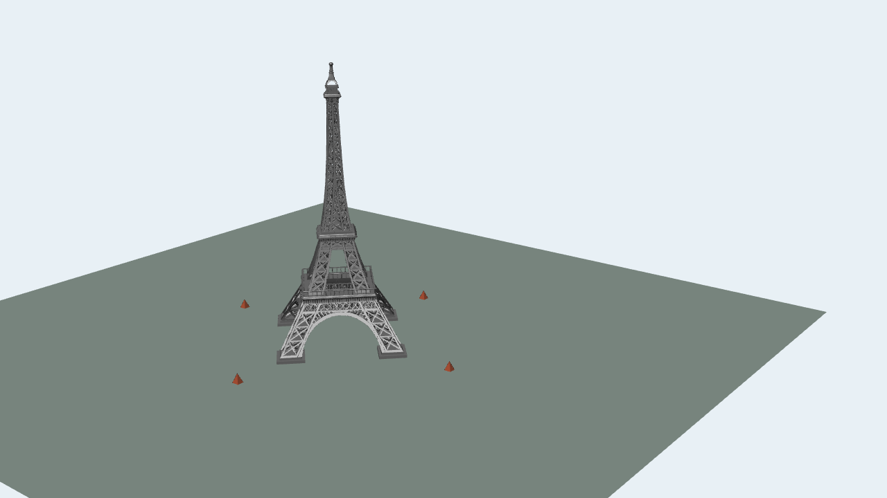
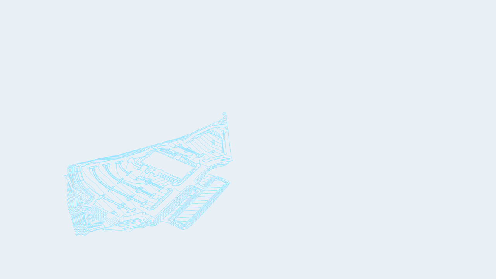
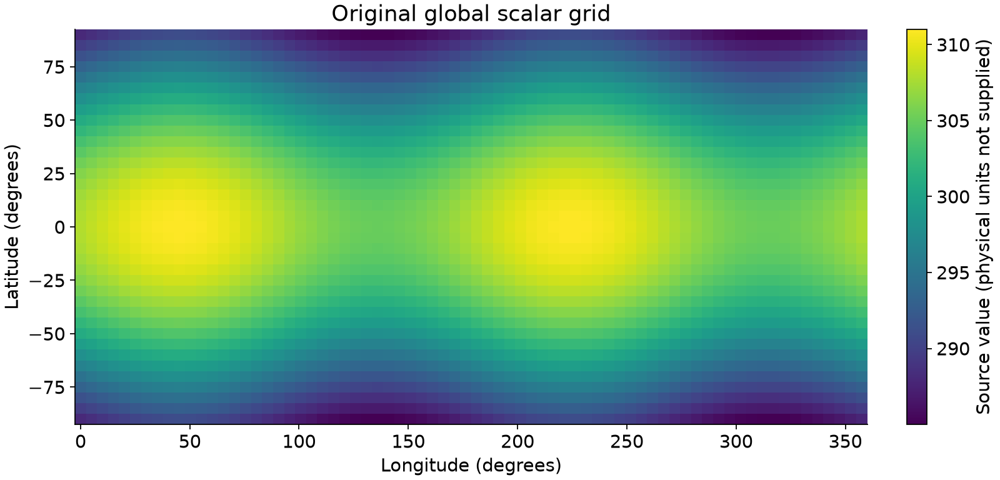
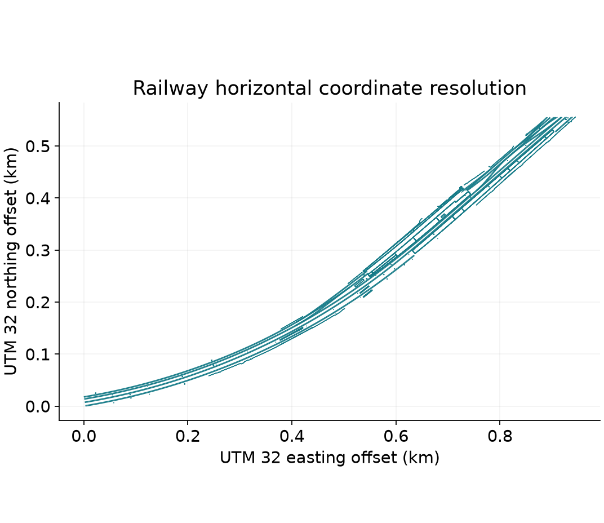

# Geospatial candidate: proposal quality and executed evidence

The four emailed leans now have **explicit local candidate contracts** for working frames, stage-axis mapping, external measurement association and Profiles dependency coverage. They are review proposals, not group agreement. **The proposal is not yet fully ready:** independently CRS-bound point-instancer prototypes remain a specialized model gap (G11). Q9 geographic scene geometry/frames/bounds remains separate from supported geographic coordinate queries. A full functional-requirement conformance claim would be premature.

This completed candidate iteration executed **64 regression tests and 47 distinguishing controls**, with 204,729 coordinate results per path in Python and C++. It includes live Omniverse geometry writeback, two native Hydra/Storm renders, and eight freshly reread exports. All advertised evidence belongs to this frozen run.

[Editable slides](delivery/geospatial-build.pptx) · [PDF](delivery/geospatial-build.pdf) · [Run receipt](delivery/run-report.json) · [Proposal quality](proposal-quality.json) · [Requirement trace](proposal/traceability.md) · [Build loop](BUILD_LOOP.md)

## Proposal authority and decisions requiring review

The sole authority is the [whole local proposal candidate](proposal/proposal-source.txt), SHA-256 `2120953af221f83816486afbe88a06768e206d23cb570b5e39a193f254ba7a11`, based on published revision `a5c7dd3792503e09b75abfa84b0caef9d80feea6`. Derived notes add no authored fact or normative behavior. All 31 functional requirements have a source trace. Concrete candidate details extend the agreed direction and need review on their own merits.

| Subject | Explicit local answer |
|---|---|
| Q3: ordinary adjustments | Nearest enclosing CRS supplies the fixed working chart. The candidate spells out chart zero/site origin, pivots and descendant resets. |
| Q6: stage conventions | Z-up uses (x,y,z). Y-up uses (x,-z,y). Stage units precede dimensionless scale and orientation. |
| Q11: external measurements | Proposed non-Xformable GeospatialDataSource identifies asset, format, field and coordinate domain. Native formats retain values, masks and observation times. |
| Q12: dependency declaration | Existing Profiles ClaimsAPI on defaultPrim carries a proposed hard capability claim. Publishers conservatively maintain whole-scene coverage, including unloaded content. |

The external association is a proposed **new typed schema**, not an assertion that the existing schema already supplies these fields. `data:asset`, `data:format`, `data:field` and `data:coordinateDomain` select data; WKT retains authority for CRS meaning. `crs:position`, `crs:orientation` and `crs:scale` describe models separately from ordinary xformOps. No coordinate-epoch attribute, duplicated WKT axis/unit metadata, private binding relationship or already-resolved flag is authored.

The geographic working-chart origin, Cartesian chart-zero pivot, anchor-adjustment versus descendant-offset distinction, external association carrier and whole-scene Profiles maintenance are concrete proposals. An implementer must not infer group approval from passing tests. The group still needs to decide whether independently bound point-instancer prototypes belong in initial scope or a later extension. The run rejects that combination in both implementations. Coordinate epochs remain deferred without foreclosing a future model.

## Physical placement and ordinary transforms

The complete point map preserves source placement and transports ordinary adjustments through a fixed authoring chart. A geographic asset beneath a projected site uses its own geographic coordinates. Its ordinary +10 adjustment moves it 10 metres along site easting even with a 90-degree model orientation. A descendant +3 local-X offset follows the oriented model. A descendant reset removes the ordinary anchor adjustment while retaining intrinsic CRS placement. The enclosing model's ordinary +100000 does not leak into an independently bound asset.

The same adjusted physical positions survive an ECEF output request. Explicit pivots and inverse ops follow UsdGeom's evaluated order. Invalid nearest bindings fail even when the ordinary adjustment is identity; both forward and inverse requests are covered. Y-up centimetre controls independently verify the axis mapping, scale and orientation. Its local-frame Jacobian rows are `[[0.0, 0.020000000000000004, 0.0], [0.0, 0.0, 0.04], [0.02999999901900689, 6.661338147750939e-18, 0.0]]` in metres per stage unit.

Cartesian local frames are numerical derivatives of the full map, with an explicit chart, units and convergence residual. They may contain shear and are not reduced to a quaternion and diagonal scale. Resolved polygonal bounds enclose every returned vertex and straight polygonal face. Neither a derivative nor those bounds certifies the nonlinear image of a continuous source surface. A same-CRS Cartesian affine case has an analytical zero approximation error, separate from floating arithmetic; requests for uncertified nonlinear extent guarantees fail visibly.

## Eiffel model and native Hydra rendering

The original model contributes **163,440 resolved vertices**. Python and C++ evaluate complete geometry. The exporter consumes the C++ results, rebases float geometry around double translations, and writes an ordinary USD scene in the output CRS. A fresh Python reader and a fresh C++ reader reject double placement. UsdImaging's scene index supplies points and transforms to native Hydra/Storm, whose readback agrees with the exported ordinary-USD world geometry. The image has an illustrative plane and markers, not surveyed Paris context or independent ground truth. This route is a resolved-export bridge, not a live geospatial scene-index filter.

## Colorado survey geometry and site calibration

The Colorado workflow resolves **14,359 original LandXML breakline vertices** into the calibrated site CRS. It does not fabricate a terrain surface. US survey feet remain declared CRS units; the stage basis and metre conversion remain separate. The site calibration lives in WKT, while object placement lives on the model. The underlying source geometry and definitions remain unchanged.

## Non-visual measurements and regional geometry

The global CF illustration retains **2,664 original scalar values and horizontal coordinates**. Original physical units and observation times were not supplied, so neither is invented. A request for 3D ECEF fails without a height reference and coordinate. The original dataset is preserved; a separately authored illustrative CF association makes its horizontal coordinate roles explicit.

The synthetic multi-domain CF case selects geographic or projected coordinates for the same 12 samples. The values, one missing mask and two observation times stay paired through resolution and export. Observation time is not a coordinate epoch. GeoTIFF controls preserve explicit band/IFD selection and PixelIsArea/PixelIsPoint sample locations.

The original railway contributes **15,822 horizontal vertices across 2,386 parts**. The reader follows RFC 7946 semantics for an explicitly written horizontal copy and projects it into UTM 32. The original third components remain intact and uninterpreted. Plot offsets are only for display, not an authored calibration or changed source values.

## Same partner coordinate inputs in both implementations and the OV host

| Case | Source E / N / H | USD Python output | USD C++ output | OV-hosted Python output |
|---|---|---|---|---|
| CC49 to Lambert-93 (m) | 1661099.0390, 8180053.1170, 37.2980 | 661101.1094, 6857834.2565, 37.2980 | 661101.1094, 6857834.2565, 37.2980 | 661101.1094, 6857834.2565, 37.2980 |
| Colorado State Plane to Westminster site grid (ftUS) | 3108002.1122, 1752265.0666, 5482.9424 | 3108871.4501, 1206317.4694, 5484.6779 | 3108871.4501, 1206317.4694, 5484.6779 | 3108871.4501, 1206317.4694, 5484.6779 |

All 59 France controls are queried in both directions and all five Colorado controls in the selected source systems. Provider CSVs are PROJ-generated intake/rounding references, not survey truth. Matching output numbers do not establish geodetic accuracy. The independent axis, pivot, reset, interpolation and failure controls distinguish implementations that share the same projection engine.

## Actual consumers and shared components

| Path | Placement implementation | Actual destination |
|---|---|---|
| USD Python | candidate.runtime.Runtime complete point map | numeric records, geometry and frame queries |
| USD C++ | native/leans.cpp independent placement arithmetic | numeric records and geometry used by export |
| Omniverse live geometry | same Python placement implementation | runtime point buffers and double world matrices, read back; 27 edit/failure/recovery checks |
| Hydra / Storm | C++ results baked by exporter; no live CRS filter | Hydra points/transform readback plus native Storm color AOV PNG |

There are **two placement implementations**, Python and C++. Omniverse reuses the Python interpretation and PROJ through a separate live geometry sink. It writes runtime point buffers and double world matrices, reads them back, and exercises source edits, failed resolution hiding stale geometry, and recovery. It is not a third independent placement engine. No Omniverse rendering or physics integration is claimed. Native Hydra consumes the C++-resolved export and performs real rendering.

The live sink read back **177,846 vertices** over the geometry cases, with 27 update/failure/recovery checks. Its maximum writeback error is **15.757 micrometres** against resolved coordinates. Python/C++ coordinate agreement is at most **2.946 nanometres** in these cases, under a predeclared 1 mm acceptance distance. Native PROJ 9.4.1 and Python/OV PROJ 9.8.1 produce matching realized pipeline spelling; selected resource files and the native database/library have hashes in the receipt. Agreement is computational evidence, not independent geodetic certification. External format decoding is shared.

## Source interpolation and freshly reread exports

Source longitude moves from 0 to 2 degrees at zero ellipsoidal height. Core interpolates source placement before ECEF conversion. At time 5 the result is the 1-degree surface position. Interpolating only the converted endpoints instead produces a chord, whose midpoint differs by **971.421 m**.

The sampled geometry export writes actual `timeSamples` keys **0, 5 and 10**, with explicit `timeCodesPerSecond = 48`. Fresh Python and C++ readers verify every exported geometry sample. Core interpolation of those output samples remains ordinary USD behavior; this does not claim the original trajectory between export samples.

Eight exports cover Eiffel geometry, Colorado breaklines, composition, instances, three CF coordinate-domain cases and sampled geometry. Their fresh-reader geometry error is at most 15.758 micrometres. CF exports retain original measurement values, missing masks and observation-time associations. Materializing instances preserves the tested resolved geometry and source-path association in the receipt, but does not certify all instancing, material or authored normal/primvar behavior. Exported Scenes conservatively retain the proposed Profiles hard dependency claim; no private resolved marker is used.

## Postimplementation audit and remaining limits

The reverse audit finds only the eight geospatial fields defined by the candidate. The source closure, original data/scene inputs, transformation-resource files and generated fixture bytes remain unchanged during execution. The two negative jobs reject missing height and independently bound point-instancer prototypes in Python and C++.

Recovery also caught implementation defects rather than filling them with new proposal facts: registered schema fallbacks had hidden blocks and bad declarations; an inverse path bypassed an invalid enclosing binding; an OV host timeline update modified an input layer. Readers now inspect authored declarations/blocks and enclosing bindings. The live host protects source layers and keeps authorized edit controls in a restored session layer. Expected rejection checks accept contract errors, not arbitrary exceptions.

G11 and Q9 remain visible design matters. The adapters visibly refuse unimplemented BOUNDCRS and geographic gravity-height ENU charts, unsupported format coordinates, and uncertified continuous extent/trajectory requests. Native validation is not a second independent WKT normalizer. Physics, a live geospatial Hydra filter and a general surface/material export guarantee have no evidence here. These are limits on advertised conformance; a green run cannot erase them.

## Reproducing and deriving delivery

`run.py` requires a fresh output directory, the OpenUSD SDK/native build, PROJ/resources and the installed OV host. It freezes source and inputs, compiles the executed native targets, runs independent contract checks, reads every query/consumer output and audits source preservation. `collateral/derive_leans_delivery.py --run <directory>` checks that frozen source before deriving this README, public evidence and slide data. `collateral/leans_slides.mjs` derives the editable deck from that README and immutable numerical returns. Delivery verification checks both claim boundaries and the final artifact hashes. Local-path relinking in public fixture copies is ordinary writer work and is recorded separately from immutable executed inputs.
