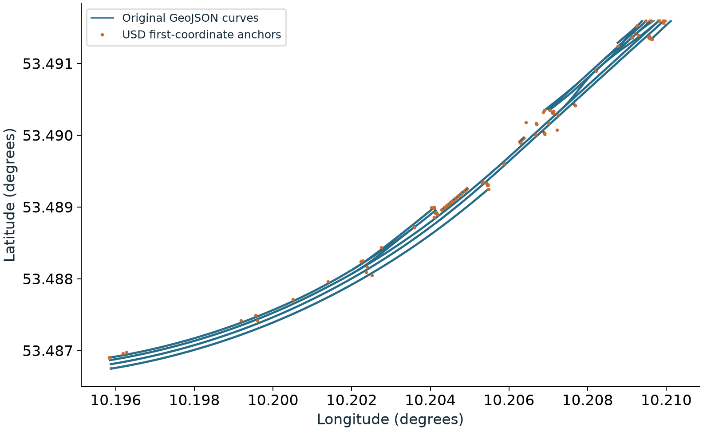
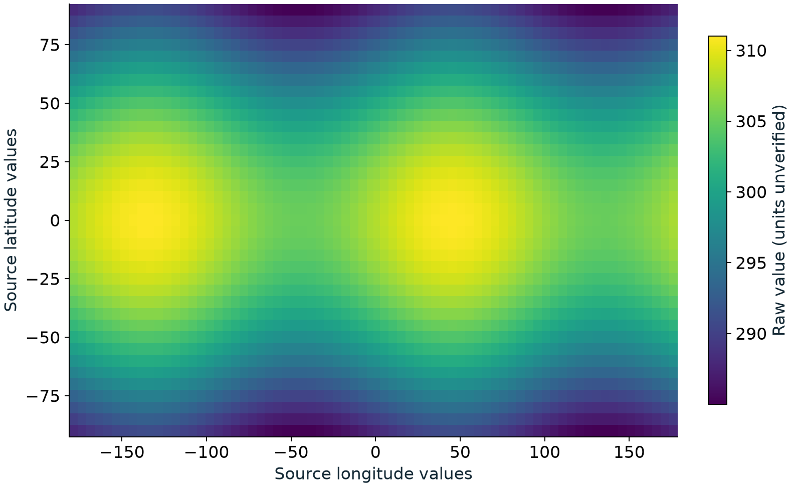

# usdGeospatial — runtime behavior and workflow evidence

<!-- narrative:v2 -->

## Geospatial scenes with shared placement

<!-- slide -->
- A railway, a site asset and a scalar field should retain their source coordinates while participating in one scene.
- Rendering, world-position queries, bounds and physics need the same resolved placement.

The functional requirements describe that outcome. This experiment derives the
runtime rules needed to implement it, builds bounded components, and tests them
against source data and independent references. This checkpoint establishes data
identity and several component behaviors. It does not yet place a complete scene.

The [runtime behavior draft](RUNTIME-BEHAVIOR.md) is the proposed normative
description for specification review. The [open decisions](RUNTIME-OPEN-DECISIONS.md)
and [traceability report](RUNTIME.md) separate unfinished rules from implementation evidence.

## Railway source and scene identity

<!-- slide -->
<!-- evidence:railway -->
- 1,473 source features match USD object identities and first-coordinate anchors.
- 186 railway curves retain 3,526 vertices by count; interior placement is still unchecked.
<!-- /evidence:railway -->
- These checks establish what survived conversion; they do not establish resolved rails-on-map placement.



The original GeoJSON makes the comparison independent of the converted USD scene.
Every source object identifier matches its USD counterpart. First coordinates agree
after explicitly reconciling GeoJSON longitude/latitude with the legacy USD
latitude/longitude storage. Curve vertex counts agree per feature. These checks
do not validate interior vertices, polygon topology or a transformation to a project CRS.

The intended demonstration is an imported railway and its map tiles placed with
a site asset, then relocated through ordinary scene edits. The source's third
ordinate still needs a vertical reference and epoch before survey-accuracy claims.
The data plot preserves source coordinates without interpreting that ordinate as height.
See [dataset provenance and access](../../DATASETS.md).

## Native interpolation preserves the authored path

<!-- slide -->
- R20, Positions between recorded moments: interpolate recorded coordinates in their CRS, then convert.
<!-- evidence:interpolation -->
- Interpolating converted endpoints puts the equatorial midpoint 971.421 m inside the ellipsoid.
<!-- /evidence:interpolation -->
- This is an analytic component example; the scene position carrier and its sampling rules remain open.


At the native midpoint, longitude is zero and the converted point lies on the
ellipsoid. Interpolating converted Cartesian endpoints instead follows a chord.
The difference exposes an evaluation-order mistake even when both endpoint
conversions are numerically correct. It constrains the runtime's evaluation
order without selecting an authored USD property or an output CRS.

## Scalar data and a removable visualization

<!-- slide -->
<!-- evidence:field -->
- 2,664 scalar samples on a 37 by 72 grid exercise coordinate reporting; a three-sample overlay is removable.
<!-- /evidence:field -->
- The stock-USD overlay leaves source values intact. Geospatial placement of that overlay is still pending.
- Forecast origin, timestamp, CRS metadata and value units are unverified; the filename is not provenance.



A non-geometric dataset should be usable without a permanent visualization baked
into it. The current test creates neutral sample records and adds then removes a
geometry-only overlay for three selected samples. Its numerical coordinate probe
explicitly assumes WGS 84 and zero height; that assumption does not establish the
source dataset's geodetic meaning. The retained fixture is a useful workflow input,
but it is not an independently verified weather product.

## Proposed runtime contract

<!-- slide -->
- Composed declarations establish CRS scope; source coordinates and asset conventions remain authored data.
- Resolution evaluates native positions and offsets into one selected output CRS without modifying the stage.
- Queries and consumers share the result; failures and operation provenance remain explicit.

The canonical prose is [proposal/runtime-behavior.md](RUNTIME-BEHAVIOR.md).
It traces all 29 functional requirements, including composition behavior, native
time evaluation, local precision, dependency discovery and engine agreement.
Coverage is not completeness: [seven grouped decisions](RUNTIME-OPEN-DECISIONS.md)
still prevent a complete executable contract. Experimental schema names and binding
policies are recorded separately in `derivation.json`, alongside links to evidence.

The build pins both the requirements and reviewed prose hashes. A changed input or
unreviewed prose change invalidates the derivation. Generated runtime trace reports
are not the source of normative text.

## Two runtime targets

<!-- slide -->
- Non-Hydra: a renderer-independent scene resolver for placements, coordinate queries and bounds. Not built.
- Hydra: a scene-index adapter consuming the same resolved placement and propagating changes. Not built.
- Consumer consistency is distinct from R29, Implementable from the text alone, which requires different transformation engines.

| Layer | This checkpoint | Required next behavior |
|---|---|---|
| Composed-binding inspector | Reads experimental CRS relationships, overrides and forwarded targets | Approved scope and binding rules |
| Coordinate-engine adapter | Explicit WGS 84 geographic/geocentric conversion, failure handling and provenance | Approved operation policy; datum, resource and epoch cases |
| Non-Hydra runtime | Absent | Decode positions, resolve placement, queries and bounds; retain authored data |
| Hydra adapter | Absent | Expose resolved placement to rendering; time and edit invalidation |
| Independent-engine comparison | Absent | Compare independently chosen implementations with stated operations and controls |

Two consumer paths may share the non-Hydra resolver; that is not two independent
geodetic implementations. The prior prototype's reference runtime and Hydra scene
index are not included in this requirements-derived build. Its raw datasets and
workflow questions are retained without inheriting its algorithms or expected answers.

## Next complete demonstration

<!-- slide -->
- Import the railway and a site asset, resolve them into one project CRS, and verify placement against independent controls.
- Relocate an asset, scrub time and compose another layer; compare non-Hydra queries with Hydra results after each change.
- State placement error and valid extent, preserve source data, and fail visibly when a required operation cannot run.

This demonstration needs decisions on position storage and boundaries (S01),
native versus project CRS semantics (S02), basis/units/extent (S03), target selection
(S04), update dependencies (S05), operation resources and controls (S06), and scope
(S07). Independent work can proceed where a decision is irrelevant, but an end-to-end
success claim must wait for the applicable decisions and provider controls.

The [workflow matrix](WORKFLOWS.md) tracks eight demonstrations, their current
checks and remaining gaps. None is marked fully validated. The existing AECO
example, when available locally, checks the partner's stated stock-USD placement
and calibrated grid; it does not validate this new runtime.

## Review requests

<!-- slide -->
- Review the proposed runtime prose against the functional requirements and close the carrier, placement and scope decisions.
- Supply source CRS/epoch/vertical metadata, expected control points and a distance-and-extent acceptance criterion.
- Use the next railway/site demonstration to review both consumer paths and separate engine agreement from correctness.

Read the [behavior draft](RUNTIME-BEHAVIOR.md) first, then its
[open decisions](RUNTIME-OPEN-DECISIONS.md). The [traceability report](RUNTIME.md)
connects each section to requirement numbers and current titles; the
[fixture matrix](FIXTURES.md) states the oracle and limit of each check.
Approval of draft functional requirements or runtime rules must be explicit;
passing checks do not record approval.

## Run evidence

<!-- evidence:run -->
**51 passed, 0 failed, 0 skipped.** These are component and build-integrity checks, not full-workflow conformance.

Run record: [20260921-runtime-review](report.json). Requirements revision: `eab823f46dad7c959019e5ce1851c8295c2a3701`.
Runtime prose SHA-256: `ba400cf0c11e3d1feb016e20af4172f26b7060a6ea19c66303c1f77292b67058`.
Implementation base: `3b0f8840107667e3cfd8a4d2536eebf9239b7ebb`; local changes: **true**. Exact tested files are hashed in the run record.

The original analytic coordinate probe measured a maximum Cartesian residual of **0.000000000 m**. Its 0.000001 m numerical tolerance is not a scene-placement accuracy budget; PROJ's operation accuracy estimate remains unknown.
<!-- /evidence:run -->

The [workflow report](WORKFLOWS.md) distinguishes supplied datasets, component
evidence and pending full workflows. Private fixtures are not redistributed; a
rerun without them records explicit skips. Numerical residuals, source-preservation
checks and partner baselines answer different questions and do not add up to a
conformance claim.

## Reproduce and deliver

Install the pinned dependencies in `requirements.txt` and `requirements-datasets.txt`.
Use [DATASETS.md](../../DATASETS.md) to fetch or import optional data into an external cache.

```sh
python run.py --output /absolute/path/outside-checkout/run-001 --dataset-root /path/to/cache
```

The bundled requirements support reruns without a proposal checkout. Supply
`--aeco-zip /path/to/attachment.zip` for the partner baseline. Exit 2 records remaining
design/evidence gaps; exit 1 is an execution or test failure. Optional data checks
skip when absent. This narrative's three data figures require the corresponding
datasets; a delivery with less evidence must revise its scope rather than reuse stale figures.

The README's explanation is authored. Delivery refreshes only marked evidence
blocks, derives the review guide and slide content, and checks that neither drifted.
The figures are reproducible source-data and analytic plots, not runtime screenshots.
The [build procedure](../../BUILD_LOOP.md) covers figure generation, slide review and
the separate publication step. Earlier checkpoint records remain immutable.

[Slides (PDF)](checkpoint.pdf) · [Editable slides](checkpoint.pptx) ·
[Derived review text](PR_BODY.md)
